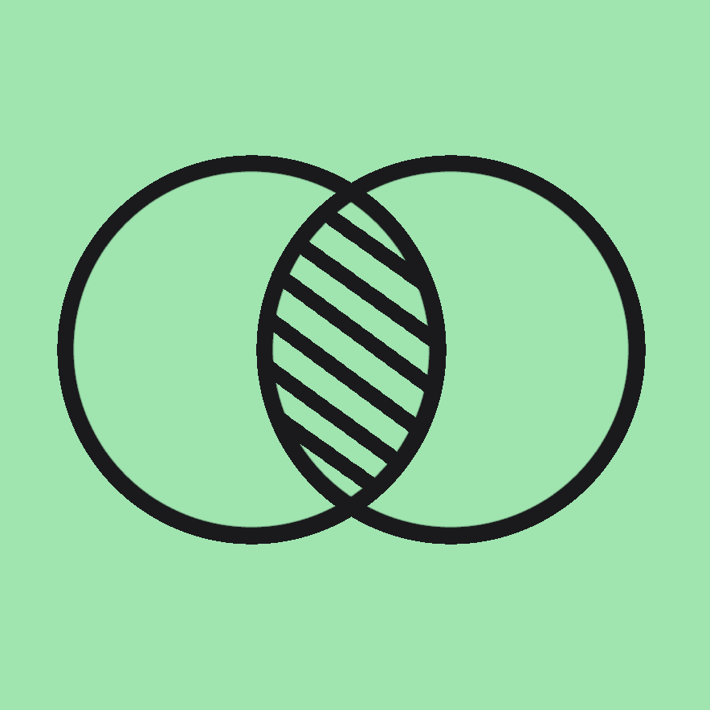

  

<h3 align="center">Peekus</h3>

  

    Trabajo de Fin de Grado de Ingeniería Multimedia en la Universidad de Alicante
  

  

    Conforme avanza el mundo, la tecnología va creciendo y teniendo cada vez más cabida en nuestras vidas. A pesar de todos los aspectos positivos que aporta, es muy criticada por cómo en ocasiones nos aísla y hace perder el contacto a las personas, debilitando los lazos que nos unen.
    Este proyecto pretende demostrar que a través de la tecnología también se pueden conservar estos vínculos, fomentando la interacción humana e incitando a la sociabilidad.
    Peekus presenta una solución en la que, de manera interesante y atractiva, se crea una imagen colaborativa para dejar grabada una situación específica; se ofrece un collage realizado por un conjunto de fotografías de distintas personas, tomadas en un mismo periodo de tiempo, que representa un momento determinado al que luego se puede volver para rememorar.
  

